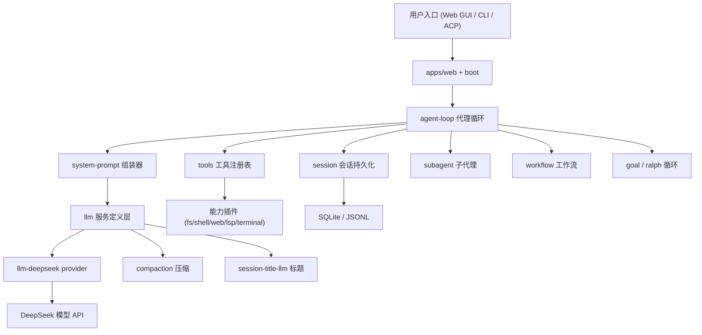
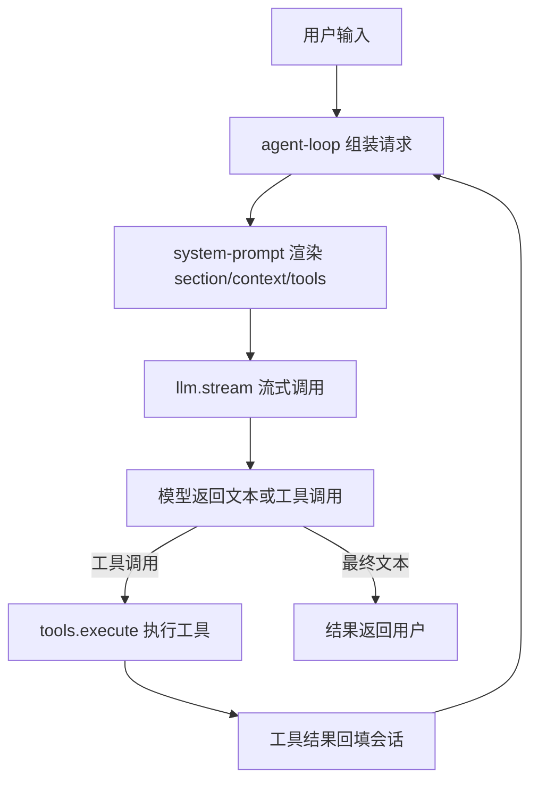
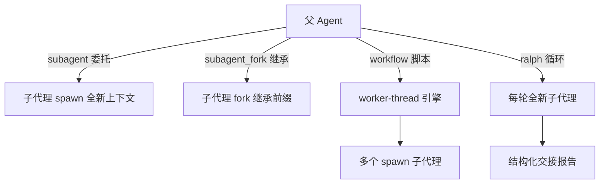

# DeepSeek Harness (dsh) 大模型应用分析报告

> 项目来源：https://github.com/deepseek-ai/deepseek-harness
> 分析日期：2026-08-14
> 项目类型：多智能体框架 / AI Agent 平台

---

## 第 1 章：项目概述

### 项目名称
DeepSeek Harness（`dsh`）

### 项目描述
DeepSeek Harness 是 DeepSeek AI 开发的开源 Agent Harness，采用"一切皆插件（everything is a plugin）"架构，基于 vendored 的 [Cordis](https://github.com/cordiverse/cordis) 插件系统构建。它是一个用于组装、运行和编排 AI 编码代理的框架底座——驱动着 DeepSeek 的 Web GUI（默认 `http://127.0.0.1:3080`），同时支持 headless 命令行与 ACP（Agent Client Protocol）自动化服务器三种运行形态。

### 主要功能
- **对话式编码代理**：读写文件、编辑代码、执行 shell 命令、搜索网页、调用 LSP 精确定位符号
- **多智能体协作**：`subagent` / `subagent_fork` 工具把任务委托给独立的子代理（spawn/fork/acp 三种 provider）
- **工作流编排**：`workflow` 工具用模型编写的 JavaScript 脚本扇出大量子代理任务
- **长任务目标循环**：`create_goal` / `update_goal` 工具让单个会话围绕一个不可变目标自动多轮推进
- **Fresh-agent 迭代**：`ralph` 工具以"每轮全新子代理 + 有界结构化交接"方式逼近目标
- **文件沙箱安全**：read-only / workspace-write / danger-full-access 三档策略 + 审批流
- **技能系统**：`skill` 工具加载可复用的任务指令包（SKILL.md）
- **会话持久化与压缩**：会话日志持久化、上下文压缩（KV 缓存对齐）、会话标题自动生成

### 技术栈
- **语言**：TypeScript（ESM everywhere，`strict: true`）+ 少量 Python SDK / native（C++ landlock）
- **插件框架**：vendored Cordis（`@deepseek-ai/cordis`）
- **构建/包管理**：pnpm workspaces（219 个 package），tsdown / tsc
- **前端**：VitePress + React（apps/web shell，packages/client/* 插件）
- **运行环境**：Node.js ^22.19 || >=24
- **数据持久化**：SQLite（会话数据）+ JSONL（会话日志）/ zstd 压缩

### LLM 相关依赖及版本
| 依赖包 | 作用 |
|--------|------|
| `@deepseek-ai/dsh-llm` | LLM 服务定义层（Service Definition / Consumer，provider 抽象、消息/工具类型） |
| `@deepseek-ai/dsh-llm-deepseek` | DeepSeek 官方 provider（thinking/reasoningEffort 推理控制） |
| `@deepseek-ai/dsh-llm-pi-ai` | Pi AI provider（convert 适配，消息格式转换） |
| `@deepseek-ai/dsh-schemastery` | 配置/参数 Schema 校验（基于 zod 风格） |
| `@deepseek-ai/dsh-token-meter` | token 计量与上下文压力投影 |
| `@deepseek-ai/dsh-compaction-basic` | 上下文压缩（调用 LLM 做总结） |
| `@deepseek-ai/dsh-session-title-llm` | 会话标题生成（调用 LLM） |

模型（来自 `examples/headless-agent/cordis.yml` 与 `examples/acp-agent/cordis.yml`）：
- `deepseek-v4-flash`（快模型）
- `deepseek-v4-pro`（强模型，全思考模式 `thinking: enabled` + `reasoningEffort: max`）

---

## 第 2 章：项目架构与数据流

### 2.1 模块级架构图

DeepSeek Harness 的核心是 Cordis 插件系统：所有能力（工具、LLM provider、会话、沙箱、技能等）都以插件形式挂载到共享的 Context 上，通过服务注册与事件解耦。系统提示词由多个插件的贡献按 order 排序组装而成。



### 2.2 单次请求时序图

一次用户输入的完整链路：agent-loop 组装请求（系统提示词 + 工具 Schema + 历史消息），经 LLM 服务定义层路由到 DeepSeek provider 流式调用，模型可能发起工具调用，工具执行后结果回填，循环直到模型给出最终答复。



---

## 第 3 章：提示词分类统计

| 类别 | 数量 | 用途说明 |
|------|------|----------|
| 系统提示词核心层 | 5 | 身份声明、persona 模板槽、运行时上下文信封、源码检出位置、Web 界面定向 |
| 工具使用指导层 | 19 | bash/pwsh/read/write/edit/grep/glob/web_search/web_fetch 等工具的 system-prompt 指导 + Code Mode SDK 说明 |
| 动态上下文注入 | 7 | 沙箱策略、审批策略、子代理委托、工作区指令、技能目录、时间/tmux 上下文 |
| 长指令提示词 | 7 | Cordis 动态插件规范、压缩指令、检查点前言、标题生成、goal/Ralph 轮次提示 |
| 运行时修复提示词 | 3 | 上下文清除标记、崩溃修复重试指导 |
| Agent 技能（SKILL.md） | 11 | 项目自身的开发辅助技能（归档为技能，不逐个翻译） |
| **合计** | **41 个提示词 + 11 个技能** | |

详细清单见 `translated_prompts/MANIFEST.md`，逐条中文翻译见 `translated_prompts/INDEX.md` 索引的 41 份翻译文档。

---

## 第 4 章：大模型应用场景分析

### 场景 1: 主循环生成（核心场景）
- **触发条件**: 每次用户输入或工具结果回填后，agent-loop 组装下一步请求
- **使用的提示词**: [harness:identity](/prompts/01-core/core_system-prompt_harness-identity_prompt_zh)、[deployment:persona](/prompts/01-core/core_system-prompt_deployment-persona_prompt_zh)、[工具指导层全部](/prompts/)、[动态上下文](/prompts/)
- **代码位置**: `packages/core/agent-loop/src/agent.ts`、`packages/core/system-prompt/src/index.ts`
- **输入输出**: 输入=系统提示词 + 工具 Schema + 历史消息；输出=模型文本或工具调用
- **模型参数**: model=deepseek-v4-flash/pro（来自 cordis.yml 路由），thinking=enabled, reasoningEffort=max
- **作用**: 这是项目的主干——系统提示词按 order 排序组装（-100 身份 → -99 源码位置 → -98 Web 界面 → 0 persona → 99 code-only → 100-199 工具指导 → 190 文件引用），动态上下文（沙箱 110 / 审批 115 / 子代理 120）作为 user 角色持久快照注入

### 场景 2: Code Mode（run_code 工具）
- **触发条件**: 模型调用 `run_code` 工具，在受控代码运行时内执行 TypeScript/Python 程序
- **使用的提示词**: [CODE_ONLY_INSTRUCTION](/prompts/02-tools/core_tools_code-only-instruction_prompt_zh)、[SDK_INSTRUCTIONS (TS)](/prompts/02-tools/core_tools_sdk-instructions-ts_prompt_zh)、[SDK_INSTRUCTIONS (Py)](/prompts/02-tools/core_tools_sdk-instructions-py_prompt_zh)
- **代码位置**: `packages/core/tools/src/code-mode.ts`、`ts-types.ts`、`py-types.ts`
- **作用**: Code Mode 收敛规则声明"run_code 是唯一可直接调用的工具"，程序内部通过 `await tools.name(args)` 调用其他工具；语言感知的 SDK 说明（TypeScript/Python 双风味）动态生成 `tools:sdk` section

### 场景 3: 上下文压缩（compaction）
- **触发条件**: 上下文压力达到阈值（thresholdRatio 0.8）或 provider 溢出时
- **使用的提示词**: [COMPACTION_INSTRUCTION](/prompts/04-long/compaction_compaction-basic_compaction-instruction_prompt_zh)、[CHECKPOINT_PREAMBLE](/prompts/04-long/compaction_compaction-basic_checkpoint-preamble_prompt_zh)
- **代码位置**: `packages/compaction/compaction-basic/src/summarizer.ts`
- **作用**: 压缩指令作为"最终 user 消息"追加到回放对话后（而非独立 system prompt），使辅助调用成为上次请求的精确前缀，复用 provider 的 KV 缓存

### 场景 4: 会话标题生成
- **触发条件**: 会话需要自动标题时
- **使用的提示词**: [会话标题系统指令](/prompts/04-long/session_session-title-llm_session-title-prompt_prompt_zh)
- **代码位置**: `packages/session/session-title-llm/src/index.ts:186`
- **模型参数**: maxTokens=config.maxOutputTokens，purpose=session-title，语言感知（目标词数/字符数按 CJK 区分）
- **作用**: 辅助 LLM 调用，生成会话标题（仅返回纯文本标题）

### 场景 5: 多智能体委托
- **触发条件**: 模型调用 `subagent` / `subagent_fork` 工具委托子任务
- **使用的提示词**: [SUBAGENT_DELEGATION_CONTEXT](/prompts/03-context/subagent_subagent_delegation-context_prompt_zh)、[Ralph round prompt](/prompts/04-long/workflow_tool-ralph_ralph-round-prompt_prompt_zh)、[goal round prompt](/prompts/04-long/goal_goal-round-driver_goal-round-prompt_prompt_zh)
- **代码位置**: `packages/subagent/subagent/src/child-agent.ts`、`packages/workflow/tool-ralph/src/index.ts`、`packages/goal/goal-round-driver/src/prompt.ts`
- **作用**: 子代理继承父代理的 preset 组合，叠加固定的委托范围声明（权限范围启动时固定，不可从会话内扩大）；Ralph 循环每轮派发全新子代理，只传递不可变目标 + 有界结构化交接；goal 循环以 `<goal_round>` 帧注入续接提示

### 提示词链路图


---

## 第 5 章：工具清单

| 工具名称 | 描述（中文） | 调用场景 | 代码位置 |
|---------|-------------|---------|---------|
| bash | 执行 bash 命令 | shell 命令执行 | `packages/shell/tool-bash/src/index.ts` |
| pwsh | 执行 PowerShell 命令 | Windows 命令执行 | `packages/shell/tool-pwsh/src/index.ts` |
| read | 读取文本文件（带行号） | 查看文件内容 | `packages/fs/tool-fs/src/read.ts` |
| write | 创建/覆盖文件 | 写文件 | `packages/fs/tool-fs/src/write.ts` |
| edit | 精确字符串替换编辑 | 局部修改文件 | `packages/fs/tool-fs/src/edit.ts` |
| grep | 正则搜索文件内容 | 代码搜索 | `packages/fs/tool-fs-search/src/grep.ts` |
| glob | glob 模式匹配文件路径 | 文件发现 | `packages/fs/tool-fs-search/src/glob.ts` |
| web_search | 网络搜索 | 获取实时信息 | `packages/web/tool-web/src/search.ts` |
| web_fetch | 抓取网页内容 | 读取网页 | `packages/web/tool-web/src/fetch.ts` |
| run_code | 在代码运行时内执行程序 | Code Mode 批量操作 | `packages/core/tools/src/code-mode.ts` |
| job_output | 读取后台任务输出 | 后台任务收集 | `packages/jobs/tool-jobs/src/index.ts` |
| job_list | 列出后台任务 | 后台任务管理 | `packages/jobs/tool-jobs/src/index.ts` |
| job_kill | 取消后台任务 | 后台任务管理 | `packages/jobs/tool-jobs/src/index.ts` |
| skill | 加载技能完整指令 | 技能调用 | `packages/skill/tool-skill/src/index.ts` |
| create_goal | 创建会话目标 | 长任务目标 | `packages/goal/tool-goal/src/index.ts` |
| update_goal | 更新目标（edit/pause/resume/complete/blocked） | 长任务目标 | `packages/goal/tool-goal/src/index.ts` |
| get_goal | 读取当前目标 | 长任务目标 | `packages/goal/tool-goal/src/index.ts` |
| subagent | 委托子代理（后台可选） | 多智能体协作 | `packages/subagent/tool-subagent/src/index.ts` |
| subagent_fork | 继承上下文的子代理 | 多智能体协作 | `packages/subagent/tool-subagent/src/index.ts` |
| workflow | 编排工作流脚本 | 大规模扇出 | `packages/workflow/tool-workflow/src/index.ts` |
| ralph | Fresh-agent 循环迭代 | 迭代逼近目标 | `packages/workflow/tool-ralph/src/index.ts` |
| terminal_* | 持久终端管理 | 持久 shell 会话 | `packages/terminal/tool-terminal/src/index.ts` |
| schedule_* | 定时任务管理 | 定时提醒 | `packages/schedule/schedule/src/tools.ts` |
| mcp__* | MCP 工具动态桥 | 外部 MCP 服务 | `packages/mcp/tool-mcp/src/tools.ts` |

### 关键工具 Schema 示例

**工具名称: run_code**

```json
{
  "name": "run_code",
  "description": "Execute a TypeScript program against the available tools...",
  "parameters": {
    "type": "object",
    "properties": {
      "code": { "type": "string", "description": "The program: the body of an async TypeScript function." },
      "description": { "type": "string", "description": "Clear, concise description of what this program does in active voice, 5-10 words (shown in the UI)." }
    },
    "required": ["code", "description"]
  }
}
```

**工具名称: job_output**

```json
{
  "name": "job_output",
  "description": "Read a background job...",
  "parameters": {
    "type": "object",
    "properties": {
      "job_id": { "type": "string", "description": "Job id returned by the tool that started the background work." },
      "wait": { "type": "boolean", "description": "Block until the job reaches a terminal status..." },
      "timeout_ms": { "type": "number", "description": "Max wait in milliseconds..." }
    },
    "required": ["job_id"]
  }
}
```

> 完整的工具 Schema（含 bash/pwsh/fs/web/schedule/terminal 等 21+ 个工具）详见各工具包的 `defineTool` 定义，参数均通过 `dsh-schemastery` Schema 校验。

---

## 第 6 章：模型调用参数汇总

| 调用位置 | 模型 | temperature | max_tokens | 其他参数 | 用途 |
|---------|------|-------------|------------|---------|------|
| `examples/headless-agent/cordis.yml` | deepseek-v4-flash | 未显式设置（默认） | 未显式设置 | provider=deepseek-official | 主循环生成 |
| `examples/acp-agent/cordis.yml` | deepseek-v4-pro | 未显式设置 | 未显式设置 | thinking=enabled, reasoningEffort=max | 主循环生成（ACP） |
| `packages/compaction/compaction-basic` | 路由模型 | 未显式设置 | maxTokens=8192 | thresholdRatio=0.8, retainRatio=0.08 | 上下文压缩 |
| `packages/session/session-title-llm` | 路由模型 | 未显式设置 | maxOutputTokens（配置） | purpose=session-title | 标题生成 |
| `packages/workflow/tool-ralph` | spawn provider | 未显式设置 | 未显式设置 | maxRounds=256 | Ralph 循环 |

> 模型参数主要来自 cordis.yml 配置文件（`model`、`thinking`、`reasoningEffort`），而非写死在代码中。temperature/max_tokens 多数未显式设置，依赖 provider 默认值。maxTokens 等预算参数（8192、16000 等）来自各能力包的 Config 默认值。

---

## 第 7 章：上下文工程

### 7.1 系统提示词组装机制

DeepSeek Harness 的提示词工程核心是一个**模块化 section 组装器**（`packages/core/system-prompt/src/index.ts`）：

- **section**：静态文本或 provider 函数，按 `order` 升序拼接，`{{variable}}` 严格插值
- **context**：动态上下文，渲染为 user 角色的持久快照（"Current runtime context..." 信封），变化时才注入
- **variable**：提示词变量，按调用上下文求值
- **tool schema**：工具 JSON Schema 注入，支持 toolOrder 显式排序
- **作用域分层**：全局层 / 作用域层（子代理、preset）通过 ScopedLayers 叠加，近作用域同名覆盖

**order 约定**：`-100` harness 身份 → `-99` 源码位置 → `-98` Web 界面 → `0` persona → `99` code-only → `100-199` 工具指导带 → `190` 文件引用。动态上下文用 110（沙箱）/115（审批）/120（子代理委托）。

### 7.2 动态上下文快照

沙箱策略、审批策略、子代理委托范围、工作区指令（AGENTS.md）、技能目录、时间/tmux 等运行时状态作为 context 注入，由 `RuntimeContextProjection` 追踪——快照变化时才生成新 user 消息，避免每轮重复注入，且快照变化通过 `system-prompt/change` 事件驱动。

### 7.3 上下文压缩（compaction）

压缩采用 **KV 缓存对齐**策略：压缩指令作为最终 user 消息追加到回放对话后（而非独立 system prompt），使辅助调用成为上次请求的精确前缀，复用 provider 的 warm prefix cache。压缩产出结构化检查点（`<compacted-summary>` 包裹的 8 小节），检查点作为"已建立上下文"替换旧消息。

### 7.4 工作区指令注入

`agent-instructions` 插件自动发现并注入工作区的 `AGENTS.md` / `CLAUDE.md` 指令文件，用 `<system-reminder>` 框架包裹，支持用户全局指令（`$DSH_HOME/AGENTS.md`）、项目级与嵌套包级指令，按字节预算截断。这实现了"项目用 AI 开发自身"的提示词闭环。

### 7.5 多 Agent 协作拓扑



各 Agent 角色由 persona（部署级 + 每子代理 shadow）定义，子代理权限范围启动时固定（sandbox mode + approval=never），不可从会话内扩大。

---

## 第 8 章：关键发现与总结

- **项目共发现 41 个提示词、约 21 个工具定义**（另有 11 个 Agent 技能 SKILL.md）
- **核心使用模式：多智能体框架 / AI Agent 平台**——这是少见的"提示词即产品"的项目：系统提示词的组装机制本身就是核心产品能力，而非业务代码的附属
- **提示词工程特点**：
  - **模块化 section 组装**：提示词由数十个插件按 order 排序贡献，而非单一文件写死
  - **动态上下文快照**：沙箱/审批/子代理/工作区/技能目录等运行时状态作为 user 角色持久快照注入，变化才更新
  - **KV 缓存对齐压缩**：压缩指令作为前缀复用 provider 缓存，工程化程度极高
  - **语言感知 Code Mode**：TypeScript/Python 双风味的 SDK 说明 + 收敛规则
  - **有界结构化交接**：Ralph/goal 循环用 JSON Schema 约束子代理的轮次报告
- **外部平台托管**：无（提示词全部内联在代码中，无 prompt_id 外部引用）
- **亮点**：
  - 提示词与工具 Schema 的"模型可见 ⟺ 可日志重建"不变式（model-visible ⟺ logged）
  - 每个能力 seam 完整包含 Service Definition / Provider / Consumer 三角色
  - 沙箱策略/审批策略通过 context 注入而非硬编码，安全边界清晰
- **改进空间**：
  - 项目处于 developer preview，兼容性会破坏（README 明确声明）
  - 提示词分散在 219 个 package 中，新人理解组装全貌的成本较高
  - temperature 等模型参数多数未显式配置，依赖 provider 默认值，调优空间未充分暴露
