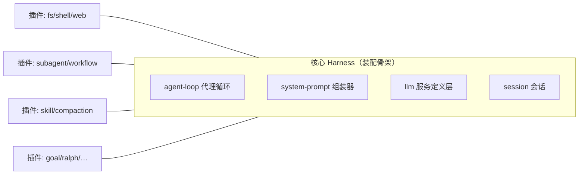
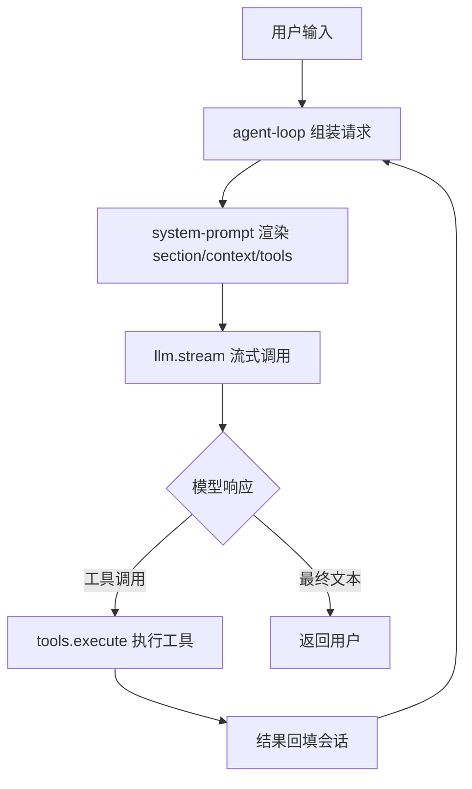

## 关于这个项目

DeepSeek Harness（`dsh`）是 DeepSeek AI 开发的开源 Agent Harness，采用"**一切皆插件（everything is a plugin）**"架构，基于 vendored [Cordis](https://github.com/cordiverse/cordis) 插件系统构建。

它驱动着 DeepSeek 的 Web GUI（默认 `http://127.0.0.1:3080`），同时支持 headless 命令行与 ACP 自动化服务器三种运行形态。

::: tip 项目拆解结论
- **76 个模型可见提示词** + 11 个 Agent 技能 + 约 21 个工具定义
- 核心模式：**多智能体框架 / AI Agent 平台**
- 提示词工程特点：模块化 section 组装、动态上下文快照、KV 缓存对齐压缩
:::

## "一切皆插件"架构

核心 Harness 提供装配骨架（agent-loop、system-prompt 组装、LLM 调用、会话管理），**能力全部以插件形式按需挂载**——文件系统、shell、子代理、工作流、技能、压缩等都是插件插槽上的一个模块。

## 整个系统流程图

从用户输入到模型响应、再到工具执行的完整回路。LLM 是循环的驱动者：它决定调用哪个工具、根据工具结果决定继续还是结束。

## 学习路径建议

1. **入门**：先读 [产品说明书](/guide/product-guide)，了解它能做什么、怎么跑起来
2. **深入**：再读 [技术分析报告](/guide/analysis)，理解架构与数据流
3. **精研**：按模块浏览 [提示词库](/prompts/)，逐条对照英文原文与中文翻译
4. **实践**：回到源码仓库，对照 `packages/core/system-prompt` 理解组装机制

## 内容来源

本站内容由 `lark-project-archive` 技能对 [deepseek-harness](https://github.com/deepseek-ai/deepseek-harness) 仓库的系统化拆解生成。
